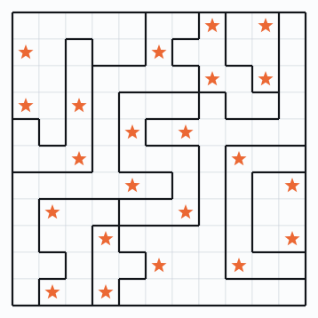
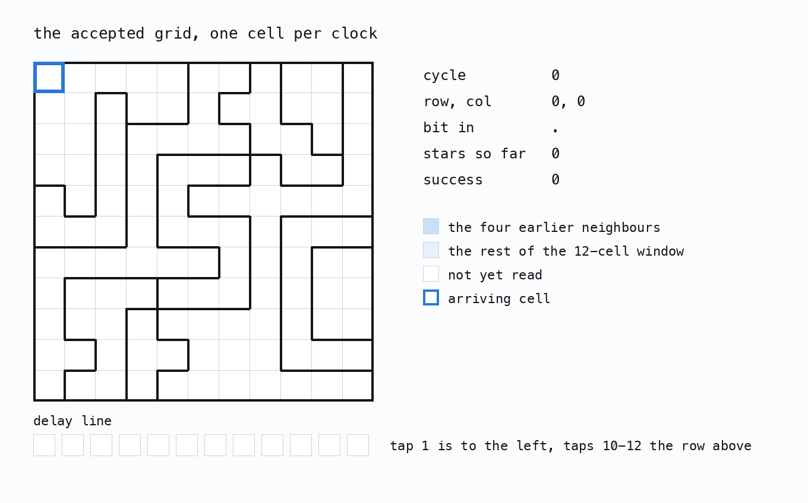

# Reverse-engineering the Jane Street ASIC puzzle

The chip is an 11 by 11 two-star Star Battle checker. It reads the grid one cell
at a time, never stores it, accepts exactly one arrangement, and then emits
`(* TWO STARS *)`.

<p align="center">
  
</p>

<p align="center">
  <strong><a href="WRITEUP.md">Read the writeup →</a></strong> ·
  <a href="TOOLCHAIN.md">Toolchain and commands</a> ·
  <a href="https://blog.janestreet.com/can-you-reverse-engineer-an-asic/">Jane Street's puzzle post</a>
</p>

## What I found

- **A streaming checker, not a stored grid.** 121 bits enter the design and only
  92 flip-flops exist, 12 of them in the output block. Each arriving bit bumps a
  few saturating counters and slides into a 12-deep history line, which is
  exactly enough to test adjacency against the four earlier neighbours.
- **One accepted grid.** Unrolling 122 cycles into CNF and solving gives the
  unique 22-star arrangement, confirmed independently by a Star Battle solver
  that never sees the netlist.
- **`success` is exactly the Star Battle predicate.** A bidirectional miter over
  the full 121-bit input window is UNSAT in both directions, backed by 37,382
  differential cases with no disagreement.
- **The message is not stored as text.** The output block computes
  `O = permute(LFSR) XOR mask(index)`. No plaintext exists anywhere on the die.
- **Two hidden messages.** 36 placeholder cells below the array spell
  `PER ARENAM AD ASTRA` in Morse, and the supplied `example_inputs.vcd` reads as
  `The night sky awaits`.

<p align="center">
  
</p>

## Reproducing it

Everything reruns from `puzzle.gds` alone.

```sh
python3 -m venv .venv && .venv/bin/pip install klayout gdstk numpy python-sat pillow
.venv/bin/python extract.py puzzle.gds puzzle_net.json   # layout to netlist
.venv/bin/python solve.py                                # the accepted grid
.venv/bin/python trace.py verify solution_bits.txt 20    # replay it, read O[7:0]
```

[TOOLCHAIN.md](TOOLCHAIN.md) has the rest: the second extractor, the proofs, the
Verilog and Hardcaml rebuilds, and the easter eggs.

## Map of the repository

<div align="center">

| | |
|---|---|
| `recovered.py` | Every fact recovered from the layout, in one place. Run it to check the structure against itself. |
| `extract.py`, `extract2.py` | Two independent layout-to-netlist extractors, sharing no code. |
| `sim.py`, `cnf.py`, `cells.py` | Gate-level simulator with swappable bit-parallel and SAT backends. |
| `solve.py`, `proof.py`, `diff_test.py` | Finding the grid, proving the predicate, and differential testing. |
| `regions.py`, `place.py`, `blocks.py` | Recovering the region map and putting the blocks back on the die. |
| `gen_rtl.py`, `gen_hardcaml.py`, `gen_liberty.py` | The rebuilds and the measured cell library. |
| `gen_figures.py`, `gen_datapath.py`, `gen_animation.py` | Every figure in the writeup. |
| `warmup/`, `pdk/`, `tinytapeout/` | Jane Street's warm-up design, the SkyWater cell models, and the Tiny Tapeout packaging. |

</div>