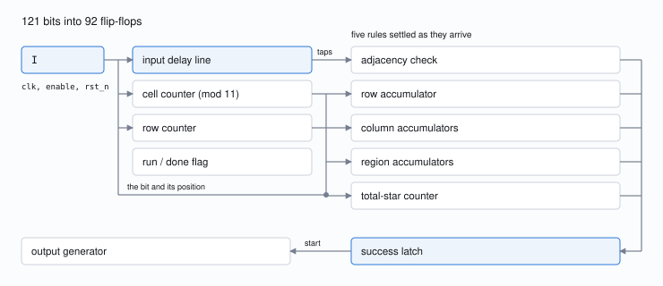
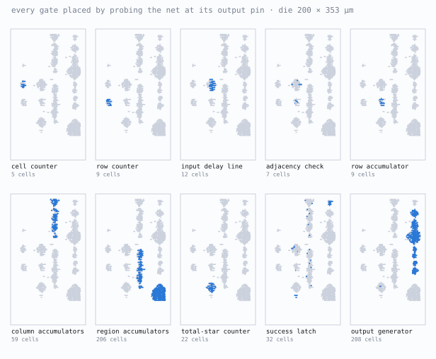
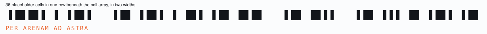

# The chip that never stores the puzzle

I went in expecting the extraction to be the wall. It wasn't, and everything
interesting happened after it. Getting the netlist was the easy half. The work
was reading a checker back out of it.

Behind the 728 logic cells on this die sits an 11 by 11 two-star Star Battle
checker that reads one bit per cycle, retains twelve of them, and still decides
every rule. It accepts exactly one arrangement, and it releases
`(* TWO STARS *)` only after that arrangement has cleared every constraint.

This is the path I took: netlist out of the layout, a gate-level simulator built
to interrogate it, the architecture recovered from the gates, three wrong turns,
and then the answer. Everything below reruns from `puzzle.gds`.

<p align="center">
  
  <br>
  The recovered region map and the only accepted grid. Every region is
  4-connected; each row, column, and region contains two stars; no two stars touch.
</p>

## What the chip is

| Property | Recovered result |
|---|---|
| Input | 121 bits on `I`, row-major, one per enabled clock |
| Verdict | `success`, one cycle after the final bit |
| Accepted grids | Exactly one |
| Payload | 15 bytes on `O[7:0]`: `(* TWO STARS *)` |
| Die | 200 by 352.7 µm |
| Logic | 728 cells, including 92 flip-flops, beside 890 inert fill, tap, decap, and diode cells |
| Extraction | 741 nets touching 5,094 resolved pin sites |

Different rows rest on different kinds of evidence, and I have tried to keep them
apart. 121 one-hot experiments establish the region map. Logic cones and
physical placement identify the block boundaries. Bounded miters establish
equivalence, and an independent Star Battle solver confirms the uniqueness the
recovered predicate had already implied. Throughout this report, an exhaustive
result carries its bound in the same sentence. A structural reading stays a
reading, even where later measurements agree with it.

## Getting a netlist

This part was easier than I expected, because the standard-cell master names, the
pin labels on `li1`, and the top-level port labels on `met3` all survived the
layout flow. KLayout's connectivity engine could therefore recover the
interconnect without recognising cells geometrically. "Nothing is labeled" still
describes the hard part of the puzzle, but the missing labels concern function,
not identity: the layout gives up its gates readily and says almost nothing about
why they are wired that way.

That made the extraction a premise I still had to test.
Running the same method on the warm-up GDS reproduced its shipped netlist
histogram exactly, 18 cell types and 230 instances on both sides. For the main
design I then wrote a second extractor around `gdstk`, exact polygon booleans,
and a separate union-find. Across all 5,094 pin sites they could probe, both
paths found the same 741 electrical partitions:

```text
pin sites found: 5095
resolved 5094 sites, unresolved 0
distinct nets touching pins: 741

sites probed in both extractions: 5094 (klayout found no net at 0)
distinct nets: mine=741  klayout=741
partitions identical: yes
```

Connectivity is not behaviour, so I gave the cell library its own check before
trusting anything downstream of it. Of the 66 instantiated cells that carry
behaviour, 63 combinational ones matched the SkyWater PDK over every input
vector, and the three sequential ones ran a directed 16-step clock, reset, and
set sequence without a mismatch.

## The tools

Almost everything after the extraction runs through one gate-level simulator,
`sim.py`, and the reason it earned that much weight is a single design choice.
The simulator compiles the extracted netlist once into a topologically ordered
graph, then evaluates it through a swappable backend. `BitBackend` represents
each net as a 64-bit integer and runs 64 candidate grids at a time. `CnfBackend`
represents each net as a SAT literal and emits Tseitin clauses instead of
computing anything. Simulation, the search for an accepting grid, and every
equivalence proof therefore run over the same gate semantics. A mistake in how I
modelled a cell cannot make the simulation and the proof disagree in my favour,
because there is only one model to be wrong.

The rest is smaller and mostly exists to keep me honest:

- `extract2.py`, a second extractor sharing no code with the first, written
  specifically so that the two could disagree.
- `recovered.py`, one file holding every fact recovered from the layout. Every
  other script imports it, so a correction cannot leave a stale copy behind, and
  running it checks that the thirteen flop groups partition all 92 flip-flops
  and that the regions cover all 121 cells.
- `regions.py`, which feeds a single star at each of the 121 input positions and
  records which accumulator moves. This measured the region map after reading it
  off the gates had produced a wrong one.
- `gen_liberty.py`, which builds a Liberty file whose Boolean functions come from
  the PDK and whose cell areas are measured out of `puzzle.gds`, so the
  re-synthesis comparison later is against this die and not a generic library.
- `starbattle_check.py`, an independent Star Battle solver that knows nothing
  about the netlist, so uniqueness could be confirmed from outside.

## How it checks a grid

I got the architecture out of the arithmetic before I had properly read a single
cone. 121 puzzle bits enter the circuit. Only 92 flip-flops exist, and 12 of
those belong to the output generator. There is nowhere near enough state to hold
the grid, which rules out every design I had been assuming. Instead, each
arriving bit bumps a handful of small counters and slides into a 12-stage history
line, which lets it settle every rule as a stream.

<p align="center">
  
  <br>
  The whole machine. One bit enters on the left, and by the time it reaches the
  verdict it has been folded into a twelve-deep window and five small tallies.
</p>

Adjacency is where that economy shows best, and it was the first block I felt I
understood. A new star has to be compared against only four earlier positions: the cell immediately to its left and the three above it.
The other four neighbours arrive later and run the reciprocal check themselves.
Masking at row edges kills the false neighbours that would otherwise wrap across
line boundaries, which leaves the complete adjacency test in seven standard
cells. In the trace below, the star at row 5, column 9 walks down the delay line
until a second star lands directly beneath it at row 6, column 9. The violation
latches on the following edge.

```text
stars at cell 64 (r5c9) and cell 75 (r6c9)

cycle         63 64 65 66 67 68 69 70 71 72 73 74 75 76 77
row            5  5  5  6  6  6  6  6  6  6  6  6  6  6  7
col            8  9 10  0  1  2  3  4  5  6  7  8  9 10  0
              --------------------------------------------
I              .  1  .  .  .  .  .  .  .  .  .  .  1  .  .
tap  1         .  .  1  .  .  .  .  .  .  .  .  .  .  1  .
tap  2         .  .  .  1  .  .  .  .  .  .  .  .  .  .  1
tap  3         .  .  .  .  1  .  .  .  .  .  .  .  .  .  .
tap  4         .  .  .  .  .  1  .  .  .  .  .  .  .  .  .
tap  5         .  .  .  .  .  .  1  .  .  .  .  .  .  .  .
tap  6         .  .  .  .  .  .  .  1  .  .  .  .  .  .  .
tap  7         .  .  .  .  .  .  .  .  1  .  .  .  .  .  .
tap  8         .  .  .  .  .  .  .  .  .  1  .  .  .  .  .
tap  9         .  .  .  .  .  .  .  .  .  .  1  .  .  .  .
tap 10         .  .  .  .  .  .  .  .  .  .  .  1  .  .  .
tap 11         .  .  .  .  .  .  .  .  .  .  .  .  1  .  .
tap 12         .  .  .  .  .  .  .  .  .  .  .  .  .  1  .
              --------------------------------------------
adjacency      .  .  .  .  .  .  .  .  .  .  .  .  .  1  1
```

The same twelve bits are easier to believe in motion. Below, the accepted grid
streams through the extracted netlist one cell per clock, with the window shown
both on the grid and as the delay line itself. Every value in the animation is
read out of the gate-level model, including the verdict at the end.

<p align="center">
  
  <br>
  121 cycles of the real netlist. The four deeper cells are the earlier
  neighbours the adjacency check is allowed to see.
</p>

The counters are just as narrow, for the same reason. Once every row, column, and
region must hold exactly two stars, no tally ever needs to tell four from five,
so saturating two bits at three preserves every decision the final comparator can
make. A row tally resets at each boundary. Eleven column tallies persist for the
whole stream. Eleven region tallies follow the hard-wired map. Those choices
explain the circuit's physical proportions: 59 cells for the column
accumulators, 206 for the regions, 9 for the current row, and only 7 to enforce
adjacency.

The region map was where I first went wrong. The accumulator cones look alike,
and I named them by inspection, which produced a map that was plausible and
wrong. So I measured it instead. Feeding one star at each of the 121 input
positions and recording which group moved recovered 11 regions whose sizes sum to
121. An independent solver then confirmed that every region is 4-connected, found
one solution before hitting its cap of five, and matched the grid the chip
accepts.

## The answer

By this point I knew what the machine accepts, so getting the grid was a search
problem. I unrolled 122 cycles into CNF through the simulator's SAT backend,
11,970 variables and 39,650 clauses, and the solver came back with the 121-bit,
22-star grid shown at the top. My first attempt at this query was unsatisfiable,
which turned out to be the right answer to the wrong question: the unroll has to
run one cycle past the grid, because at 121 cycles the verdict has not landed
yet. Simulating the gates then pinned the timing exactly.

```text
success right after last bit: 0
success one cycle later:      1

O[7:0] for the next 20 cycles:
hex: 28 2a 20 54 57 4f 20 53 54 41 52 53 20 2a 29 00 00 00 00 00
asc: (* TWO STARS *).....
```

Jane Street marked the output generator as safe to ignore, and it can indeed be
removed without disturbing `success`. Understanding it anyway explains why those
final bytes have to be simulated instead of read. I went looking for plaintext
constants among its gates and found none, which left the question of where
fifteen bytes could be hiding in a block with no obvious ROM.

What cracked it was linearity. Flipping a single LFSR bit moved exactly one
output bit, every time, which is the signature of an XOR and not of a lookup.
That pointed straight at the structure: an 8-bit LFSR combining with a 4-bit
saturating index to compute

```text
O = permute(LFSR) XOR mask(index)
```

where the fifteen message masks are `4d ad fb 83 13 79 1c b5 79 63 c7 68 93 f5
8f`, and a final mask, `6a`, occupies the saturated index and parks the output at
zero. Identical mask bytes at indices 5 and 8 emit different letters, `O` and
`T`, because the advancing LFSR supplies the difference. No plaintext exists
anywhere on the die. It materialises only as the LFSR walks away from its reset
seed.

Three experiments separate that account from a curve fit. Across all 15 emitted
bytes, flipping each of the eight LFSR bits moved exactly the one output bit the
recovered permutation predicts, giving 120 correct single-bit responses.
Randomising the LFSR destroyed the text, and randomising the index did the same.
Four un-reset flip-flops implement the index and eight more hold the LFSR, four
resetting to zero and four to one. Those four are the only set-reset flops on the
die, and they exist to keep the seed away from the all-zero state a shift
register could never climb out of.

## Cycle 124

The first readable RTL I wrote asserted the verdict on the same edge that
consumed the final bit. That belief was lazy in its evidence but not in its
origin: every simulation I had run against the known-good stream agreed with it,
and the RTL reproduced the payload byte for byte.

What broke it was bisecting on unroll depth. Equivalence against the extracted
netlist held all the way to 123 cycles and failed at 124, which placed the
disagreement one cycle past the last input rather than anywhere inside the
stream, and pinning the input to the accepted grid reproduced the failure
directly. The silicon registers the verdict a cycle later than I had written it,
so `success` moved behind one more flop.

The useful lesson was about the test, not the bug. I had simulated the one
input I understood best, and the error was sitting exactly one cycle past the
point where that simulation stopped looking. That counterexample was also not a
lucky choice by the solver. I ran 121 further miters, each forcing one input bit
away from the solution while leaving the other 120 free, and all 121 came back
UNSAT across the full 145-cycle protocol window. Both implementations compute the
same predicate and differ only in when they latch it, every output is gated by
`success`, and only one grid is ever accepted, so the sole observable
counterexample has to be the accepting run. One extra cycle of observation was
all that could have exposed a timing error on the input I had checked
most carefully.

## Not just my grid

One accepted input is weak evidence for a recovered specification, especially
when that same input guided the rebuild, and I did not want the only thing
standing behind this document to be a grid I had reverse-engineered towards. So I
built the Star Battle rules independently and compared the two predicates in both
directions. Within a
122-cycle unroll with every input bit free, `chip accepts and specification
rejects` is UNSAT, the reverse is also UNSAT, and the specification has exactly
one satisfying grid.

Differential testing then added 37,382 structured cases with no disagreement.
Those are illustrations around the proof rather than part of it, and the
stratification is the argument. Each near-miss stratum neutralises one rule so
that the others have to do the rejecting: the 2-per-row grids already satisfy the
row rule and the 22-star grids already hit the correct total, which leaves
columns, regions, and adjacency to carry the decision. The flip strata come at it
from the other side, and 91 of the 121 single-bit flips put two stars in contact,
which makes them the densest adjacency probes in the set.

```text
  solution           n=1       disagreements=0    accepted-by-chip=1
  1-bit flips        n=121     disagreements=0    accepted-by-chip=0
  2-bit flips        n=7260    disagreements=0    accepted-by-chip=0
  random 2-per-row   n=20000   disagreements=0    accepted-by-chip=0
  uniform random     n=5000    disagreements=0    accepted-by-chip=0
  random 22 stars    n=5000    disagreements=0    accepted-by-chip=0

total grids tested: 37382   disagreements: 0   accepted by chip: 1
```

Bounded equivalence is the strongest claim here, and it stays bounded. A
k-induction proof did not converge across the differently encoded state spaces,
and a fixed-point argument failed too, because an arbitrary finished state admits
unreachable assignments. One extracted net, `$1447`, has no driver and feeds two
gates in the output path; forcing it to each value in turn changes nothing, and
the predicate proof stays UNSAT in both directions when it gets a fresh SAT
variable every cycle.

One oddity I keep coming back to. An eight-bit total-star counter survives in the
design even though two stars in each of eleven valid rows already forces a total
of 22. I took it for dead logic and was wrong: it is redundant and still
load-bearing, and flipping any one of its eight flops midway through the accepted
run prevented `success` in 24 of 24 injections. Even the unreachable high bit participates, because the final
comparator tests the whole register against 22. Somebody wrote that comparison in
the source, and synthesis could not prove it away.

## Their hint as a test

Cone membership divided the design into functional blocks, and the blocks then
had to be put back on the die. I assumed at first that the netlist and the layout
enumerate their instances in the same order, which is the kind of assumption that
costs an afternoon. They do not. Zipping the two lists agrees on the cell master
at only 46 of 728 positions, against roughly 29 expected from chance alone given
how lopsided the library usage is, so the ordering assumption buys almost nothing
over guessing, and it had already sent me looking for a bug in the cone analysis
that was never there.

What actually works is probing the net at each cell's output pin and matching it
to the netlist instance driving that net, and doing it that way places 713 of the
728. The fifteen I cannot place are all `clkbuf_4` buffers sitting on the clock,
a net too widely shared to attribute back to any single instance.

I then used their physical clustering as a check I had not rigged myself. The output-generator box
in the supplied hint contains 207 of the 208 cells assigned to that cone, all 12
of its flip-flops, no flip-flop from another block, and no unshared cell from
another block. Only `$296` sits well outside the box, and nothing straddles its
boundary.

<p align="center">
  
  <br>
  One panel per recovered block. Blue cells belong to that block, grey cells are
  the rest of the logic, and every cell is placed from the geometry of its output pin.
</p>

| Block | Cells | Flops | Role |
|---|---:|---:|---|
| Cell and row counters | 14 | 8 | Locate the incoming bit |
| Run and done flags | 3 | 2 | Mark the end of the stream |
| Input history | 12 | 12 | Retain the preceding twelve bits |
| Adjacency check | 7 | 1 | Reject touching stars |
| Row accumulator | 9 | 3 | Enforce two stars in the current row |
| Column accumulators | 59 | 22 | Enforce two stars in each column |
| Region accumulators | 206 | 22 | Enforce two stars in each recovered region |
| Total-star counter | 22 | 8 | Compare the running total against 22 |
| Success latch | 32 | 2 | Register the final verdict |
| Output generator | 208 | 12 | Emit the masked message |

The rows above account for all 92 flip-flops and cover the 713 placed cells. A
further 124 are shared between cones and 17 resist single attribution.

## Back to hardware

A rebuild earns more trust when it survives another form, so I wrote the
recovered machine twice: 148 lines of Verilog and 98 lines of Hardcaml. Bounded
miters against the extracted netlist close for 145 cycles under the operating
protocol, with 3,100,406 variables and 8,531,120 clauses for Verilog and
1,831,366 variables and 4,842,030 clauses for Hardcaml. Hardcaml was the natural
second language, given that the recovered payload is already an OCaml comment.

Both then went through the same Yosys flow onto the measured Liberty. On that
basis the silicon holds 728 logic cells in 10,758 µm², Verilog maps to 451 cells
and 6,816 µm², and Hardcaml maps to 363 cells and 5,892 µm². The gap between
those totals is useful rather than embarrassing: three descriptions can be
provably equivalent and still disagree about what the circuit is made of.

Packaging the Verilog version behind the Tiny Tapeout interface closed the round
trip. Its testbench drives only `uio[0]`, reaches `success = 1`, and collects all
15 payload bytes. At 6,816 µm² against a 160 by 100 µm tile, the rebuild occupies
an estimated 43 percent by cell area. That figure is an area ratio, not an
OpenLane placement result.

## Below the die

The die bounding box read y = −52.72 µm in my first survey of the layout, which
puts its bottom edge below the cell array and outside the vertical range of the
supplied image. I wrote the number down and did not chase it.

Thirty-six placeholder cells live in that strip. I had marked them electrically
irrelevant, which was correct and incomplete. They carry no logic, but they come
in two widths, and the widths are dots and dashes.

<p align="center">
  
  <br>
  Drawn to scale, the 36 cells below the array decode to <code>PER ARENAM AD ASTRA</code>.
</p>

Following the anomaly I had ignored recovered `PER ARENAM AD ASTRA`, "through the
sand to the stars." A second message sits in `example_inputs.vcd`: reading each
row as 7-bit ASCII, least-significant bit in column zero, yields `The night sky
awaits` with two trailing spaces. Together with the payload, those messages close
the same chain the technical work builds. A labelled cell library becomes an
unlabelled netlist, the netlist becomes a streaming Star Battle checker, and only
then do the gates say what they were arranged to say.

Every number quoted above has a script behind it, and the whole path from
`puzzle.gds` to the payload reruns end to end: KLayout and gdstk for the layout,
python-sat for solving and proving, Icarus Verilog and Yosys for independent
simulation and equivalence, Hardcaml for the second rebuild, and about 4,000
lines of Python written for this puzzle.

Jacob Crainic.
